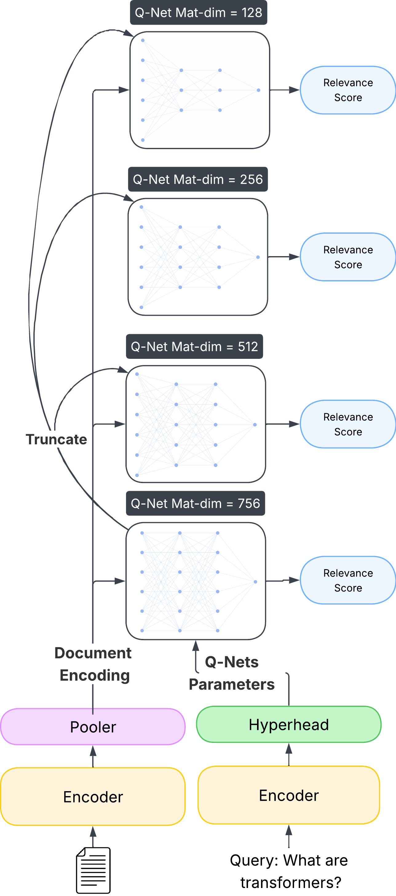

# Matryoshka Hypencoder
This is the official Repository for "The Matryoshka Hypencoder".

This repo is still a work-in-progress, but all the core code, data, and models are now available. This means you can evaluate the Matryoshka Hypencoder, use a pre-trained Matryoshka Hypencoder off-the-shelf, and reproduce the major results from the paper exactly.


This repository contains the code and experiments for the [The Matryoshka Hypencoder]() This work builds upon the original [Hypencoder architecture](https://arxiv.org/abs/2502.05364) by Killingback et al., extending it with a novel, flexible training paradigm inspired by Matryoshka Representation Learning (MRL).

The primary contribution of this project is a single, adaptive retrieval model capable of generating query-specific scoring functions (Q-Nets) of variable widths. This allows for a dynamic trade-off between retrieval effectiveness and computational efficiency at inference time.

<!-- Placeholder for Matryoshka Hypencoder Diagram -->
<p align="center">
  
  <br>
  <em>Figure 1: Overview of the Matryoshka Hypencoder architecture. The hyper-head generates a single set of full-size parameters, which can be truncated to form effective, nested Q-Nets of varying widths.</em>
</p>
<!-- End Placeholder -->

<h4 align="center">
    <p>
        <a href="#key-contributions-and-findings">Key Findings</a> |
        <a href="#installation">Installation</a> |
        <a href="#reproducing-experiments">Reproducing Experiments</a> |
        <a href="#training-a-new-model">Training</a> |
        <a href="#evaluation-framework">Evaluation</a>
    <p>
</h4>

## Key Contributions & Findings

This research makes several key contributions to the field of neural information retrieval:

1.  **Viability of Frozen-Encoder Training**: We demonstrate that a Hypencoder can be trained with its BERT backbones frozen, achieving performance statistically comparable to the original, resource-intensive end-to-end trained model. This establishes a computationally feasible paradigm for developing and experimenting with Hypencoder architectures.

2.  **Development of the Matryoshka Hypencoder**: We successfully adapt the MRL principle from embedding vectors to the parameter space of a function generator. Through a robust transfer learning methodology, we fine-tuned a pre-trained hyper-head with a multi-objective loss to produce nested, variable-width Q-Nets.

3.  **Demonstrated Performance-Efficiency Trade-off**: Our final Matryoshka model exhibits the desired "graceful degradation" property. On in-domain benchmarks like TREC Deep Learning, the model can be truncated to use **7x fewer parameters** (256-dim vs. 768-dim Q-Net) with no statistically significant loss in retrieval effectiveness.

4.  **Quantified Efficiency Gains**: This parameter reduction translates to a massive gain in scoring throughput. As shown below, smaller Q-Nets are progressively faster, with the 128-dimension Q-Net providing up to a **6x speedup** in query latency on large corpora compared to the baseline.

<!-- Placeholder for Throughput Diagram -->
<p align="center">
  
  <br>
  <em>Figure 2: Document scoring throughput (documents per second) on MS MARCO Dev, demonstrating the super-linear efficiency gains of smaller Q-Net dimensions.</em>
</p>
<!-- End Placeholder -->

## Installation

This project relies on a specific set of library versions for reproducibility. It is highly recommended to use a `conda` or `venv` virtual environment.

**1. Clone the Repository:**
```bash
git clone <your-repo-url>
cd hypencoder-paper
```

**2. Create a Conda Environment:**
```bash
conda create -n hypencoder python=3.10
conda activate hypencoder
```

**3. Install Dependencies:**
All required packages are specified in the `requirements.txt` file.
```bash
pip install -r requirements.txt
```
This will install the correct, compatible versions of `torch`, `transformers`, `datasets`, `pyarrow`, `numpy`, and all other necessary libraries.

## Reproducing Experiments

This repository is structured to make all experiments highly reproducible. The configuration files for all key experiments are located in `hypencoder_cb/train/configs/`. The final, collated results and statistical test outputs are available in the `analysis/` directory.

## Training a New Model

The training pipeline is managed by `hypencoder_cb/train/train.py` and is configured via YAML files.

#### **Starting a Training Run**
To launch a training run, provide the path to a configuration file. For example, to launch the final Matryoshka transfer learning experiment:
```bash
# For single-GPU
python hypencoder_cb/train/train.py hypencoder_cb/train/configs/final_matryoshka_transfer.yaml

# For multi-GPU using accelerate
accelerate launch hypencoder_cb/train/train.py hypencoder_cb/train/configs/final_matryoshka_transfer.yaml
```

#### **Experiment Tracking with Weights & Biases**
The `Trainer` is configured for easy integration with Weights & Biases.
1.  Run `wandb login` in your terminal and provide your API key.
2.  Set your project name: `export WANDB_PROJECT="hypencoder-dissertation"`
3.  In your YAML config file, add `report_to: "wandb"` and a descriptive `run_name` under `hf_trainer_config`. The Trainer will automatically stream all metrics, configurations, and system stats to your W&B dashboard.

## Evaluation Framework

The evaluation workflow is managed by a single, powerful orchestrator script: `run_evaluation.py`. This script reads a central YAML configuration file to run complex evaluation campaigns (e.g., multiple models vs. multiple datasets).

#### **1. Encoding a Corpus**
Before evaluation, document corpora must be pre-processed into embeddings using `hypencoder_cb/inference/encode.py`.
```bash
python -m hypencoder_cb.inference.encode \
    --model_name_or_path="path/to/your/trained_model" \
    --output_path="./encoded_corpora/my_corpus.docs_fp16" \
    --ir_dataset_name="name-of-ir-dataset" \
    --dtype="fp16" \
    --batch_size=4096
```

#### **2. Configuring an Evaluation Campaign**
Create a YAML file (e.g., `evaluation_config.yaml`) to define the experiments. This file specifies the `run_type` ("standard" or "matryoshka"), the models to test, the datasets to evaluate on, and other hyperparameters.

See `hypencoder_cb/inference/configs/example_eval_config.yaml` for a template.

#### **3. Running the Evaluation Campaign**
Launch the entire campaign with a single command:
```bash
python run_evaluation.py --config_path="path/to/your/evaluation_config.yaml"
```
The script will automatically handle data loading, model loading (including the necessary surgical fixes for certain checkpoints), and looping through all specified models, datasets, and (for Matryoshka) dimensions. Results are saved in a structured directory tree under the `base_output_dir` specified in the config.

#### **4. Statistical Significance Testing**
A script is provided at `analysis/run_statistical_tests.py` to perform paired t-tests on the generated `per_query_metrics.json` files, allowing for rigorous comparison between different models.

```